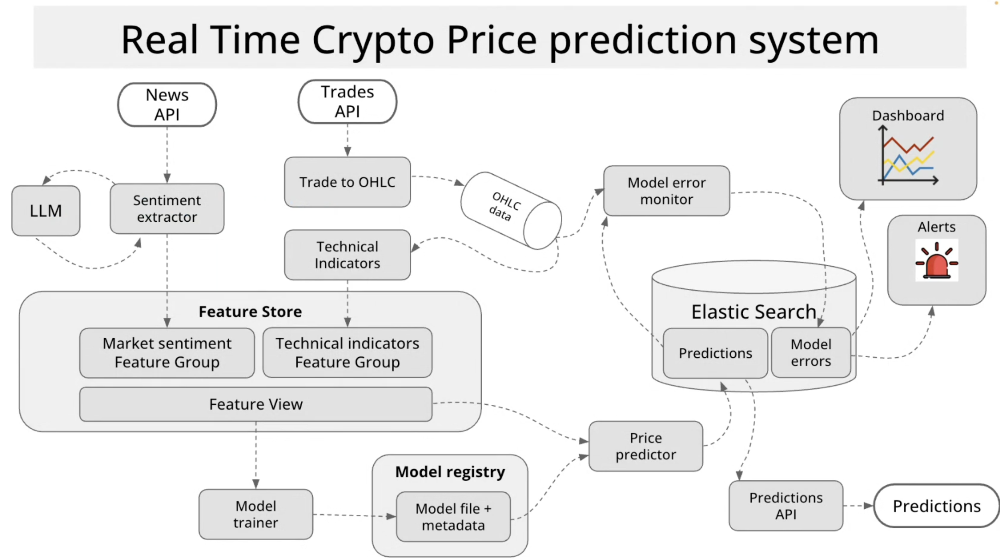
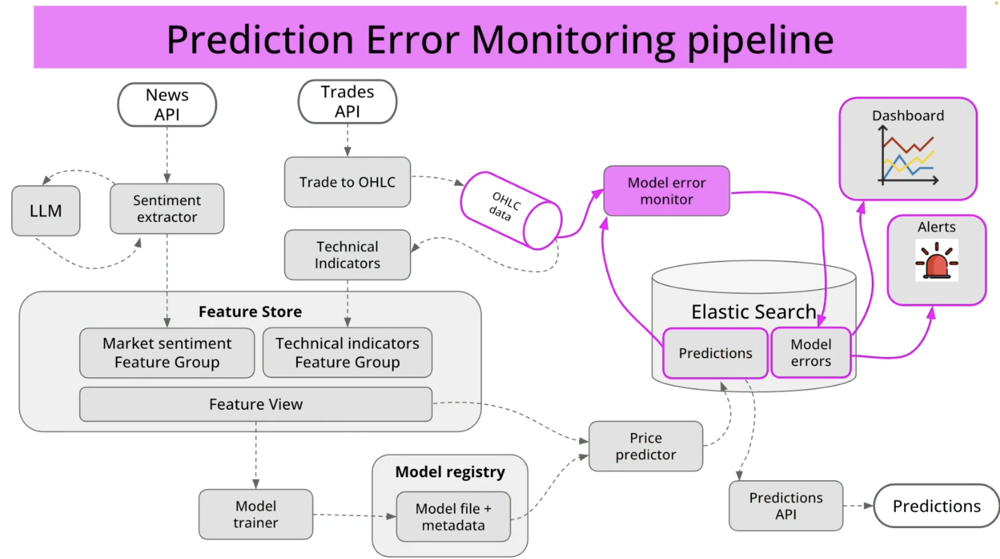

# Real-Time Crypto Price Prediction System

## Introduction

The Real-Time Crypto Price Prediction System is a sophisticated platform designed to analyze cryptocurrency market data, extract meaningful insights, and generate price predictions using machine learning techniques.

## System Goals

This system aims to:

1. Ingest and process real-time trade data from cryptocurrency exchanges
2. Extract market sentiment from financial news and social media
3. Calculate technical indicators from price movements
4. Generate real-time price predictions using machine learning models
5. Monitor prediction accuracy and adapt to changing market conditions
6. Provide a user-friendly interface for traders to view predictions and insights

## Architectural Principles

The architecture follows key principles including:

- **Microservices Architecture**: Individual, focused services with specific responsibilities
- **Event-Driven Design**: Asynchronous communication via Kafka message broker
- **Real-Time Processing**: Continuous data ingestion and prediction
- **ML Ops Best Practices**: Feature store, model registry, and monitoring
- **Scalable Infrastructure**: Kubernetes-based deployment for elasticity
- **Observability**: Comprehensive monitoring and alerting

## System Overview

The system consists of seven core microservices working together to deliver predictions:

1. **Sentiment Extractor**: Analyzes news and social media content
2. **Trade to OHLC**: Converts raw trade data to candles
3. **Technical Indicators**: Calculates market indicators
4. **Model Trainer**: Trains price prediction models
5. **Price Predictor**: Generates price predictions
6. **Predictions API**: Serves predictions to clients
7. **Model Error Monitor**: Monitors prediction accuracy

These services are supported by a robust data infrastructure including:

- **Kafka**: Message broker for event streaming
- **RisingWave**: Feature store for ML features
- **MLflow**: Model registry for version control
- **Elasticsearch**: Storage for predictions and metrics
- **Grafana**: Visualization dashboard

## Documentation Structure

This documentation is organized as follows:

1. **Introduction**: System overview and goals (this document)
2. **Data Pipelines**: How data flows through the system
3. **Services**: Detailed description of each microservice
4. **Technologies**: Key technologies and their roles
5. **Deployment**: How the system is deployed on Kubernetes 