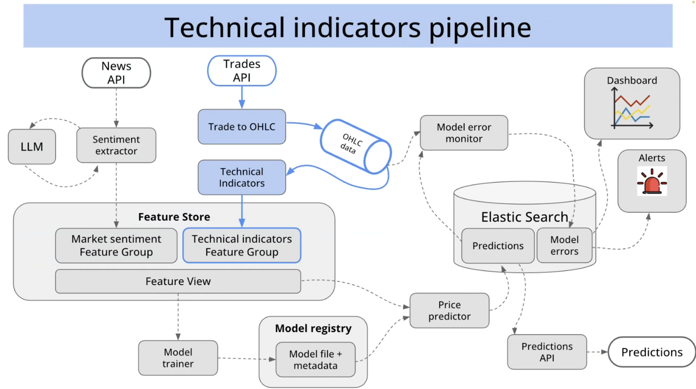

# Data Pipelines

The Crypto Price Prediction System processes data through several pipelines, from ingestion to prediction. This document outlines the key data flows within the system.

## From Raw Data to Predictions

The system follows a complete data lifecycle from raw market data to actionable predictions:

Raw data from external APIs is transformed into ML features, which are then used to train models and generate predictions that are served to traders.

## Two Feature Pipelines

The system maintains two parallel feature pipelines that feed into the feature store:

### Technical Indicators Pipeline

The technical indicators pipeline processes trade data into price candles and technical indicators:

1. The Trades API provides raw cryptocurrency trade data
2. The Trade to OHLC service converts this into Open-High-Low-Close candles
3. The Technical Indicators service calculates indicators like moving averages, RSI, etc.
4. These indicators are stored in the Feature Store's Technical Indicators Feature Group

### Market Sentiment Pipeline

The market sentiment pipeline analyzes news and social media content:

1. The News API provides financial news articles and social media content
2. The Sentiment Extractor service, enhanced by an LLM, analyzes the text
3. The extracted sentiment is stored in the Feature Store's Market Sentiment Feature Group

## From Raw Data to ML Features

The combined pipelines transform raw market data into structured ML features:

These features are organized in the Feature Store to ensure consistency between training and inference.

## Training Pipeline

The training pipeline creates models from historical feature data:

1. The Model Trainer fetches historical features from the Feature Store
2. It trains and evaluates prediction models
3. Successful models are registered in the Model Registry with metadata

## Inference Pipeline

The inference pipeline generates real-time predictions:

1. The Price Predictor fetches the latest features from the Feature Store
2. It loads the appropriate model from the Model Registry
3. It generates predictions and publishes them to Elasticsearch
4. The Predictions API serves these predictions to clients

## Prediction Error Monitoring

The system continuously monitors prediction accuracy:

1. The Model Error Monitor compares predictions with actual prices
2. Error metrics are calculated and stored in Elasticsearch
3. The Dashboard visualizes these metrics
4. The Alerts service notifies when error thresholds are exceeded

These integrated pipelines ensure that the system continuously learns from market data and improves its predictions over time. 