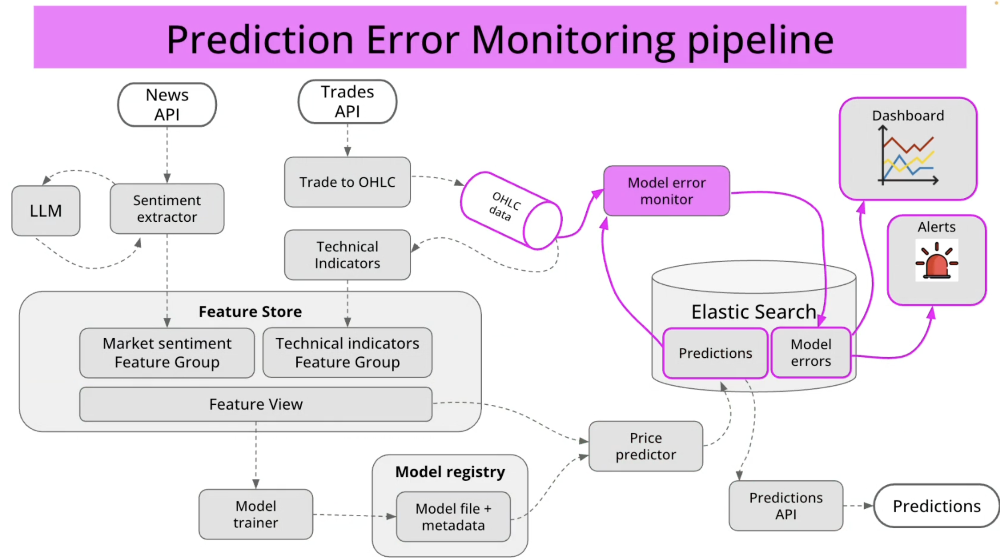

# Microservices

The Crypto Price Prediction System consists of seven core microservices, each with specific responsibilities within the overall architecture:

## 1. Sentiment Extractor

**Purpose**: Extracts market sentiment from financial news and social media content.

**Key Features**:
- Processes text data from News API
- Leverages an LLM for advanced sentiment analysis
- Quantifies sentiment on a scale (bullish/bearish)
- Categorizes sentiment by cryptocurrency
- Publishes sentiment scores to Kafka

**Technology Stack**: Python, Natural Language Processing libraries

## 2. Trade to OHLC

**Purpose**: Converts raw trade data into OHLC (Open-High-Low-Close) candles.

**Key Features**:
- Consumes trade data from external API
- Aggregates trades into time-based candles
- Supports multiple timeframes (1m, 5m, 15m, 1h, etc.)
- Handles missing data and irregularities
- Publishes candle data to Kafka

**Technology Stack**: Python, Quixstreams

## 3. Technical Indicators

**Purpose**: Calculates technical analysis indicators from price data.

**Key Features**:
- Consumes OHLC data from Kafka
- Calculates indicators (moving averages, RSI, MACD, etc.)
- Supports parameterized indicator configuration
- Publishes indicators to Kafka for storage
- Updates in real-time as new candles arrive

**Technology Stack**: Python, TA-Lib equivalent libraries

## 4. Model Trainer

**Purpose**: Trains and evaluates price prediction models.

**Key Features**:
- Retrieves historical feature data
- Prepares train/validation/test datasets
- Trains multiple model candidates
- Evaluates performance against baselines
- Registers successful models to MLflow
- Supports scheduled and on-demand training

**Technology Stack**: Python, Scikit-learn, PyTorch

## 5. Price Predictor

**Purpose**: Generates cryptocurrency price predictions.

**Key Features**:
- Fetches latest features from Feature Store
- Loads appropriate models from Model Registry
- Generates predictions with confidence intervals
- Supports multiple prediction horizons
- Publishes predictions to Elasticsearch
- Handles model versioning and fallbacks

**Technology Stack**: Python

## 6. Predictions API

**Purpose**: Serves predictions to external clients.

**Key Features**:
- Provides RESTful API endpoints
- Retrieves predictions from Elasticsearch
- Supports filtering by currency and timeframe
- Implements authentication and rate limiting
- Provides historical prediction performance
- Optimized for low-latency responses

**Technology Stack**: Rust (for performance)

## 7. Model Error Monitor

**Purpose**: Monitors prediction accuracy and model performance.

**Key Features**:
- Compares predictions with actual price movements
- Calculates error metrics (RMSE, MAE, etc.)
- Detects model drift and anomalies
- Triggers alerts on performance degradation
- Recommends model retraining when needed
- Logs detailed error information

**Technology Stack**: Python

## Service Communication

These services communicate primarily through Kafka topics, following an event-driven architecture pattern. This ensures loose coupling and allows each service to scale independently based on load. 