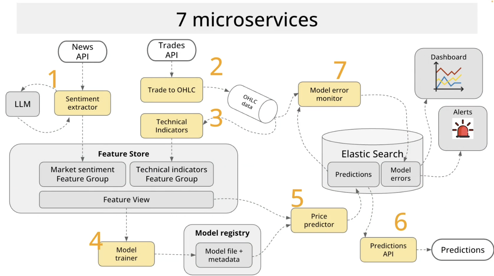

# Technologies

The Crypto Price Prediction System leverages a modern technology stack to enable real-time data processing, machine learning, and serving predictions. This document outlines the key technologies used and their roles within the system.

## Core Infrastructure

### Kubernetes

Kubernetes serves as the orchestration platform for the entire system, providing:
- Container orchestration
- Service discovery and load balancing
- Horizontal scaling of services
- Rolling updates and rollbacks
- Self-healing capabilities
- Resource management

All microservices are deployed as Kubernetes deployments, with appropriate resource requests and limits.

## Messaging

### Apache Kafka & Strimzi

Kafka serves as the central nervous system of the architecture, providing:
- Reliable message delivery between services
- Stream processing capabilities
- Event sourcing and replay
- Temporal decoupling of services
- High throughput data handling

Strimzi is used as the Kafka operator within Kubernetes, simplifying the deployment and management of the Kafka cluster.

## Data Storage

### RisingWave

RisingWave serves as the feature store, providing:
- Stream processing for feature computation
- Real-time materialized views
- SQL interface for feature access
- Feature versioning and consistency
- Low-latency feature serving

RisingWave combines stream processing with database capabilities, making it ideal for maintaining ML features.

### Elasticsearch

Elasticsearch stores predictions and monitoring data, providing:
- Fast time-series data storage
- Advanced search capabilities
- Real-time analytics
- Scalable storage
- Integration with Grafana

## ML Platforms

### MLflow

MLflow serves as the model registry, providing:
- Model versioning and metadata
- Experiment tracking
- Model lifecycle management
- Deployment management
- Performance metrics storage

## Service Implementation

### Python

Python is the primary language for most services, leveraging:
- Rich ecosystem of data science libraries
- Scikit-learn for machine learning
- PyTorch for deep learning
- Pandas for data manipulation
- FastAPI for internal APIs

### Rust

Rust is used for the Predictions API service, providing:
- High performance
- Memory safety
- Low latency
- Efficient resource usage

## Visualization

### Grafana

Grafana provides visualization capabilities:
- Real-time dashboards
- Prediction visualization
- System monitoring
- Custom alerts
- User-friendly interface

## External Components

### LLM (Large Language Model)

A large language model assists the Sentiment Extractor in analyzing text, providing:
- Advanced natural language understanding
- Sentiment analysis
- Entity recognition
- Context awareness
- Nuanced interpretation of financial news

### External APIs

- **Trades API**: Provides real-time cryptocurrency trade data
- **News API**: Provides financial news and social media content

This technology stack is designed to handle real-time data processing, machine learning, and serving predictions in a scalable, resilient, and observable manner. 